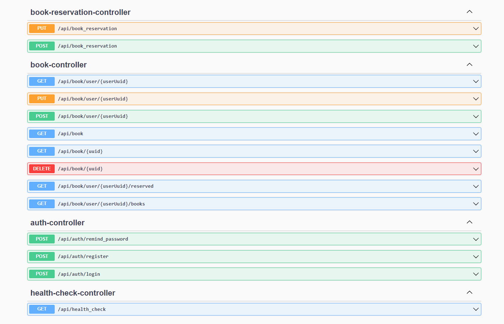
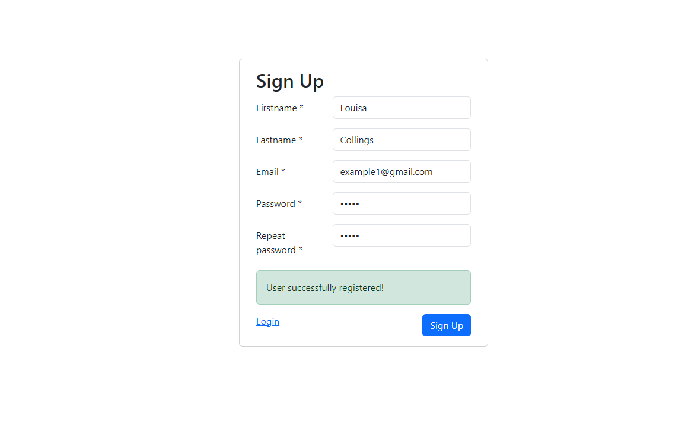
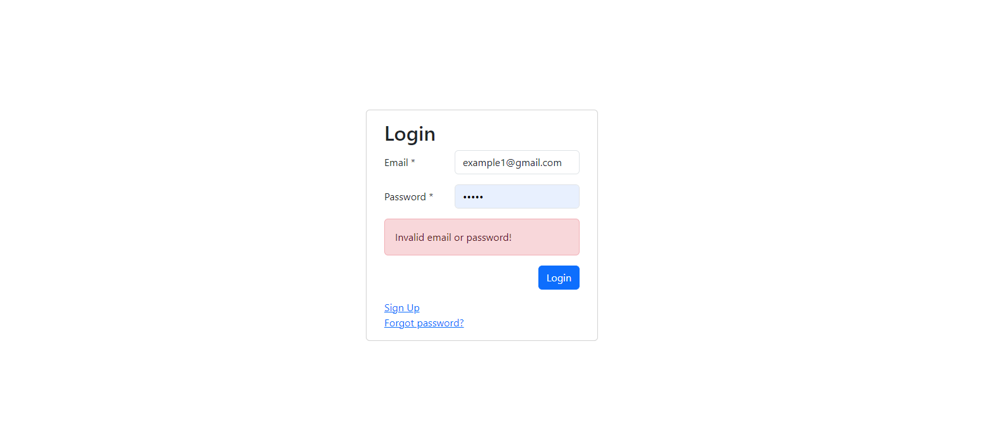
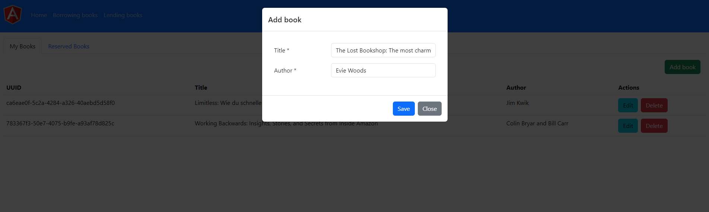
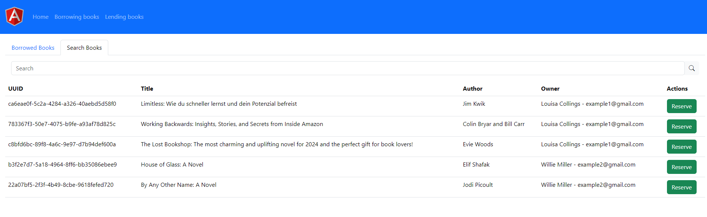
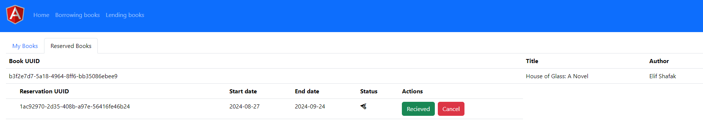
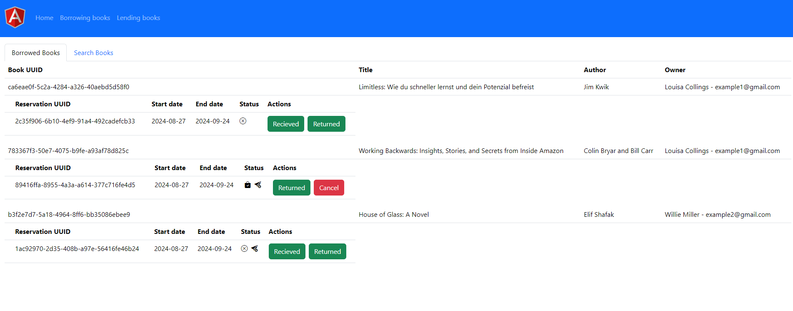

# Demo of Spring Boot application with Spring Security, JWT, Angular, Flyway, PostgreSQL

 ## Swagger:


 ## UI:







Easiest way to run:
 - 1. With maven and docker installed from project's root folder run command:
 ```
 docker compose up
 ```
 It will create container and images for backend, frontend, postgresql and apply migrations
 - 2. Navigating to http://localhost:8080/api/health_check to check is api working
 - 3. Navigating to http://localhost:8080/swagger-ui/index.html to check swagger
 - 4. Navigating to http://localhost:4200/signup to create a new user
 - 5. Navigate to http://localhost:4200/login to login
 - 6. Add books, reserve with different users

 ## Project structure:
 ```
│   docker-compose.yml
│
├───smit_1_backend
│   │   .gitignore
│   │   Dockerfile
│   │   mvnw
│   │   mvnw.cmd
│   │   pom.xml
│   │
│   ├───.mvn
│   │   └───wrapper
│   │           maven-wrapper.properties
│   │
│   └───src
│       ├───main
│       │   ├───java
│       │   │   └───com
│       │   │       └───example
│       │   │           └───smit_1_backend
│       │   │               │   Smit1BackendApplication.java
│       │   │               │
│       │   │               ├───api
│       │   │               │       AuthController.java
│       │   │               │       BookController.java
│       │   │               │       BookReservationController.java
│       │   │               │       HealthCheckController.java
│       │   │               │
│       │   │               ├───config
│       │   │               │       JwtAuthFilter.java
│       │   │               │       PasswordConfig.java
│       │   │               │       RestExceptionHandler.java
│       │   │               │       SecurityConfig.java
│       │   │               │       UserAuthenticationEntryPoint.java
│       │   │               │       UserAuthenticationProvider.java
│       │   │               │       WebConfig.java
│       │   │               │
│       │   │               ├───dtos
│       │   │               │       BookDto.java
│       │   │               │       CredentialsDto.java
│       │   │               │       PasswordReminderDto.java
│       │   │               │       RegisterDto.java
│       │   │               │       ReservedBookDto.java
│       │   │               │       SmitResponse.java
│       │   │               │       UserDto.java
│       │   │               │
│       │   │               ├───entities
│       │   │               │       Book.java
│       │   │               │       BookReservation.java
│       │   │               │       User.java
│       │   │               │
│       │   │               ├───exceptions
│       │   │               │       AppException.java
│       │   │               │
│       │   │               ├───mappers
│       │   │               │       BookMapper.java
│       │   │               │       BookReservationMapper.java
│       │   │               │       UserMapper.java
│       │   │               │
│       │   │               ├───repositories
│       │   │               │       BookRepository.java
│       │   │               │       BookReservationRepository.java
│       │   │               │       UserRepository.java
│       │   │               │
│       │   │               ├───services
│       │   │               │       BookReservationService.java
│       │   │               │       BookService.java
│       │   │               │       UserService.java
│       │   │               │
│       │   │               └───utils
│       │   │                       xConstant.java
│       │   │
│       │   └───resources
│       │       │   application.properties
│       │       │   log4j2.xml
│       │       │
│       │       └───db
│       │           └───migration
│       │                   V1__create_users_table.sql
│       │                   V2__create_book_table.sql
│       │                   V3__create_book_reservations_table.sql
│       │                   V4__add_is_sent_book_reservation_table.sql
│       │
│       └───test
│           └───java
│               └───com
│                   └───example
│                       └───smit_1_backend
│                               AuthTests.java
│                               BookReservationTests.java
│                               BookTests.java
│                               Smit1BackendApplicationTests.java
│
└───smit_1_frontend
    │   .editorconfig
    │   .gitignore
    │   angular.json
    │   Dockerfile
    │   package-lock.json
    │   package.json
    │   README.md
    │   server.ts
    │   tsconfig.app.json
    │   tsconfig.json
    │   tsconfig.spec.json
    │
    ├───.vscode
    │       extensions.json
    │       launch.json
    │       tasks.json
    │
    ├───public
    │       favicon.ico
    │       logo.png
    │
    └───src
        │   index.html
        │   main.server.ts
        │   main.ts
        │   styles.css
        │
        └───app
            │   app.component.css
            │   app.component.html
            │   app.component.spec.ts
            │   app.component.ts
            │   app.config.server.ts
            │   app.config.ts
            │   app.routes.ts
            │
            ├───components
            │   ├───borrowing-books
            │   │       borrowing-books.component.css
            │   │       borrowing-books.component.html
            │   │       borrowing-books.component.spec.ts
            │   │       borrowing-books.component.ts
            │   │
            │   ├───dashboard
            │   │       dashboard.component.css
            │   │       dashboard.component.html
            │   │       dashboard.component.spec.ts
            │   │       dashboard.component.ts
            │   │
            │   ├───date-picker
            │   │       date-picker.component.css
            │   │       date-picker.component.html
            │   │       date-picker.component.spec.ts
            │   │       date-picker.component.ts
            │   │
            │   ├───forgot-password
            │   │       forgot-password.component.css
            │   │       forgot-password.component.html
            │   │       forgot-password.component.spec.ts
            │   │       forgot-password.component.ts
            │   │
            │   ├───lending-books
            │   │       lending-books.component.css
            │   │       lending-books.component.html
            │   │       lending-books.component.spec.ts
            │   │       lending-books.component.ts
            │   │
            │   ├───login
            │   │       login.component.css
            │   │       login.component.html
            │   │       login.component.spec.ts
            │   │       login.component.ts
            │   │
            │   ├───navbar
            │   │       navbar.component.css
            │   │       navbar.component.html
            │   │       navbar.component.spec.ts
            │   │       navbar.component.ts
            │   │
            │   └───signup
            │           signup.component.css
            │           signup.component.html
            │           signup.component.spec.ts
            │           signup.component.ts
            │
            ├───models
            │       book.interface.ts
            │       book.reservation.interface.ts
            │       date.picker.event.interface.ts
            │       login.interface.ts
            │       password.reminder.ts
            │       signup.interface.ts
            │       smit-response.interface.ts
            │       user.interface.ts
            │
            ├───pipes
            │       filter.books.pipe.ts
            │
            ├───services
            │   ├───auth
            │   │       auth.guard.spec.ts
            │   │       auth.guard.ts
            │   │
            │   ├───axios
            │   │       axios.service.spec.ts
            │   │       axios.service.ts
            │   │
            │   └───modal
            │           modal.service.spec.ts
            │           modal.service.ts
            │
            └───validators
                    no-space-allowed.validator.ts
                    password-match.validator.ts
```                    
